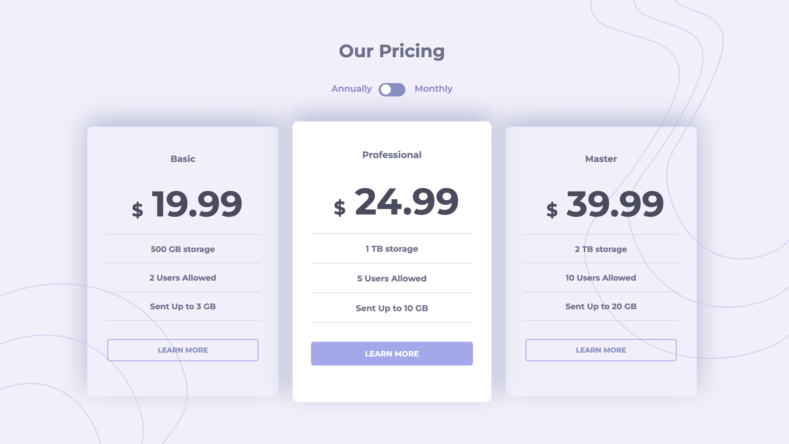

# 🏷️ Pricing component with toggle solution

---
## 🔎 Table of contents 

- [Overview](#overview)
  - [The challenge](#the-challenge)
  - [Screenshot](#screenshot)
- [My process](#my-process)
  - [Built with](#built-with)
  - [What I learned](#what-i-learned)
  - [Continued development](#continued-development)
  - [Useful resources](#useful-resources)
- [Acknowledgments](#acknowledgments)

---

## Overview 

🏷️ I come across this component for displaying pricing quite often on modern sites. For instance [Notion pricing page](https://www.notion.com/pricing). So I decided to try to create a similar component from scratch. I am interested to try to implement this component with React

---

### The challenge

Users should be able to:  
✔️ View the optimal layout for the component depending on their device's screen size  
✔️ Control the toggle with both their mouse/trackpad and their keyboard  

---

### UI

📍 

---

## My process 
------

### Built with

💡 Semantic HTML5 markup  
💡 CSS custom properties  
💡 Flexbox      
💡 [React](https://reactjs.org/) - library    
💡 [Vite](https://vite.dev/) - project builder    

---

### What I learned

📍 In progress ...

---

### Continued development

📍 In progress ...

---

### Useful resources

📍 In progress ... 

---

## Acknowledgments

💌 I thanks for my code reviewer, as well as my old dog, for the ultimate level of cuteness
